<p align="center">
  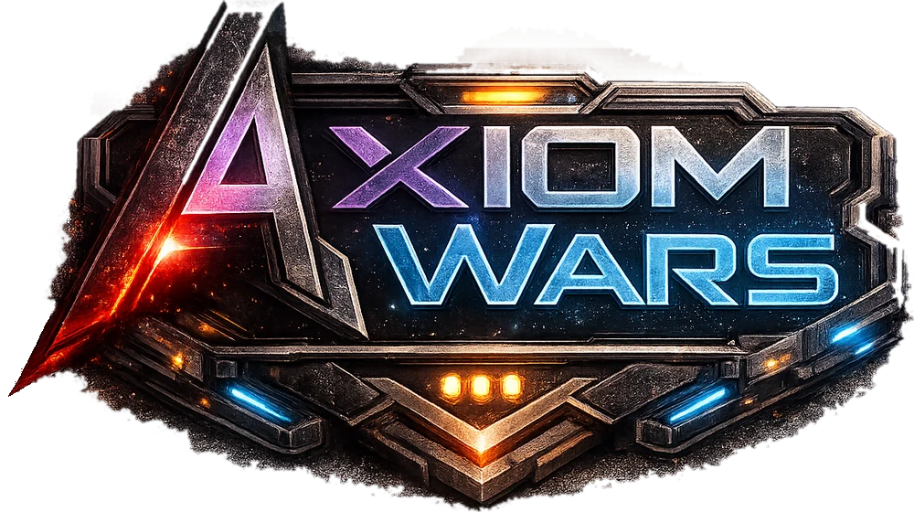
</p>

<p align="center"><a href="README.md">English</a> · <b>Español</b></p>

<p align="center">
  <b>Estrategia por rondas simultáneas de ciencia ficción.</b><br>
  Todos ordenan a la vez; nadie espera su turno.
</p>

<p align="center">
  <a href="https://cesar-rgon.github.io/axiom-wars/">Web</a> ·
  <a href="https://discord.gg/3rsTp3DdGh">Discord</a> ·
  <a href="https://github.com/cesar-rgon/axiom-wars/releases/latest">Descargar</a> ·
  <a href="docs/unidades/README.md">Unidades</a> ·
  <a href="#balanceo">Balanceo</a>
</p>

> [!NOTE]
> Axiom Wars está en desarrollo. Las partidas de prueba se organizan en el [Discord](https://discord.gg/3rsTp3DdGh).

## Qué es Axiom Wars

Construye tu base alrededor del Gobierno, mantén alimentada a tu gente y lanza tus tropas a través de la niebla de guerra. Cuando todos los jugadores confirman sus órdenes, el servidor resuelve la ronda a la vez y ves cómo chocan los planes de todos.

Hasta 8 jugadores, todos contra todos o por equipos (hasta 4 contra 4). Los huecos se rellenan con bots.

### Así es una ronda

| Fase | Qué haces |
|---|---|
| **1. Planificar** | Encolas órdenes con tus Puntos de Acción (PA): construir, mover tropas, contratar, comerciar en el Banco. Ves el coste de cada orden antes de darla. |
| **2. Confirmar** | Marcas la ronda como lista. Puedes reordenar, pausar o cancelar órdenes mientras los demás deciden. |
| **3. Resolver** | El servidor ejecuta las órdenes de todos a la vez y lo ves como una repetición: marchas, choques, edificios que se levantan y lo que la niebla deja ver. |

### Lo que hay en juego

- **Seis recursos:** Energía, Madera, Acero, Comida, Agua y Combustible. Bosques, pastos, lagunas, pozos de petróleo y minas se agotan, y cada extractor necesita trabajadores y cobertura de energía.
- **Gente que come y protesta:** cada individuo consume comida y agua. Si racionas, baja su satisfacción; si cae del todo, desertan.
- **Niebla de guerra:** sólo ves lo que alcanzan tus unidades y edificios. Puedes ordenar construir a ciegas en terreno sin explorar.
- **Gobierno en tres niveles:** subirlo da más PA y cupo de tropas y desbloquea fábricas, lanzaderas y defensas. Si cae, quedas eliminado.
- **Banco:** trueque de recursos y préstamos a devolver en unas semanas de juego.
- **Victoria:** destruye el Gobierno enemigo. Gana el último que queda en pie.

## Galería

Capturas de la versión actual. Pulsa en una para verla a tamaño completo.

<p align="center">
  <a href="assets/img/galeria-11.webp">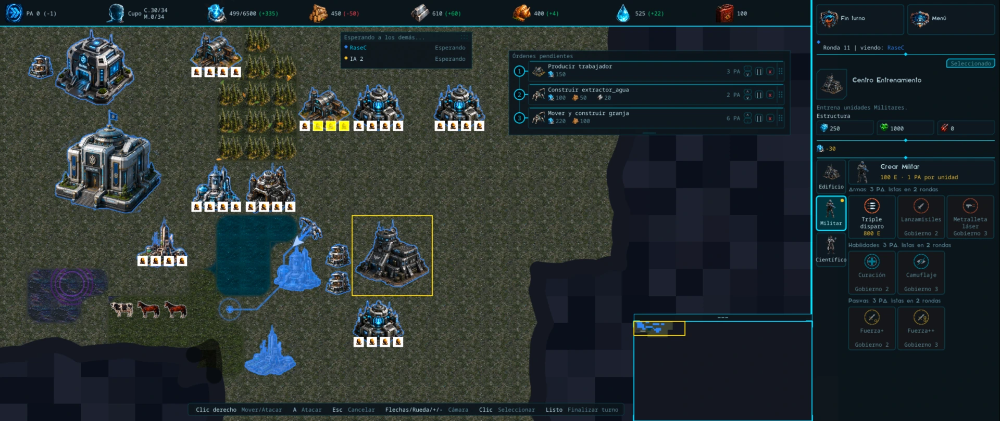</a>
  <br><sub>Ronda 11: el nuevo panel lateral muestra las armas, habilidades y pasivas de cada unidad junto a la cola de órdenes pendientes.</sub>
</p>

<table>
  <tr>
    <td width="50%"><a href="assets/img/galeria-10.webp">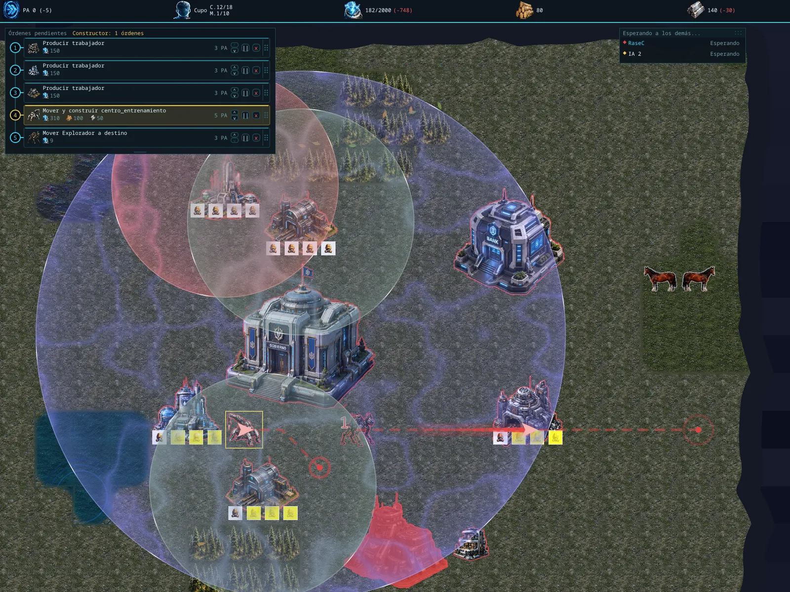</a></td>
    <td width="50%"><a href="assets/img/galeria-09.webp">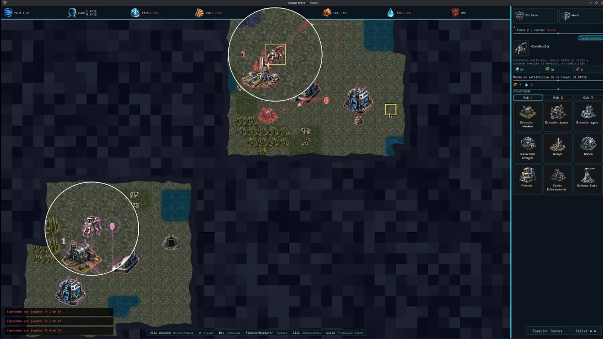</a></td>
  </tr>
  <tr>
    <td><sub>Cola de órdenes numerada, áreas de efecto superpuestas y un Explorador camino de su destino.</sub></td>
    <td><sub>Resolución de la ronda 2: las lupas siguen dos acciones que ocurren a la vez.</sub></td>
  </tr>
</table>

## Museo

Axiom Wars empezó como un cliente de terminal. Estas son las versiones por las que ha pasado, de la más antigua a la más reciente.

| Etapa | Captura | Qué cambió |
|---|---|---|
| **1** | <a href="assets/img/museo/01.webp">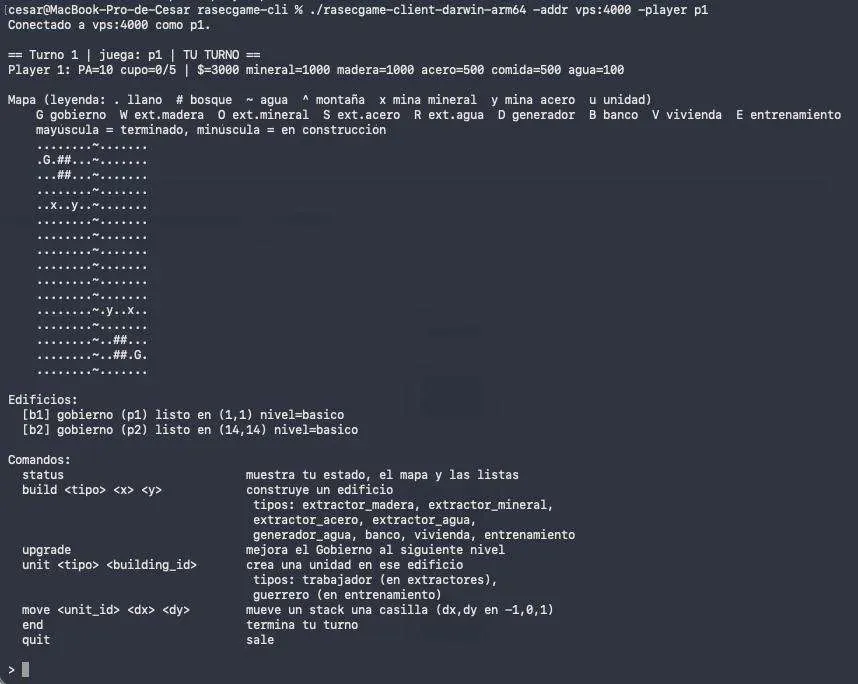</a> | **Cliente de terminal.** El mapa en caracteres ASCII y las órdenes escritas a mano: `build`, `move`, `end`. |
| **2** | <a href="assets/img/museo/02.webp">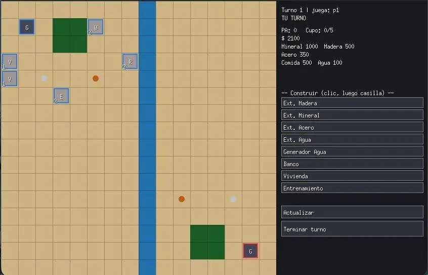</a> | **Primera ventana.** Casillas de colores planos, edificios representados por letras y botones para construir. |
| **3** | <a href="assets/img/museo/03.webp">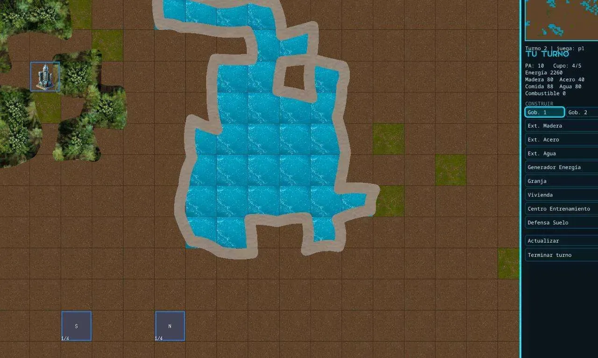</a> | **Primeras texturas.** Agua, bosque y tierra dibujados, minimapa y el primer edificio ilustrado. |
| **4** | <a href="assets/img/museo/04.webp">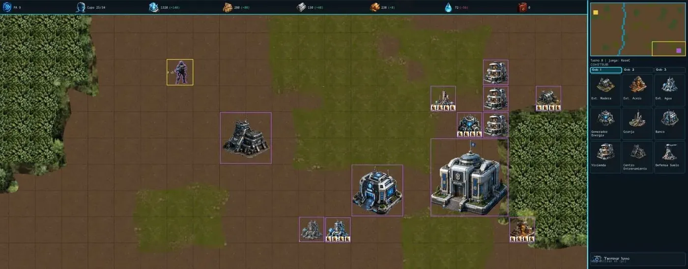</a> | **Edificios ilustrados.** Llegan el Gobierno, el Banco y el panel de construcción con iconos. |
| **5** | <a href="assets/img/museo/05.webp">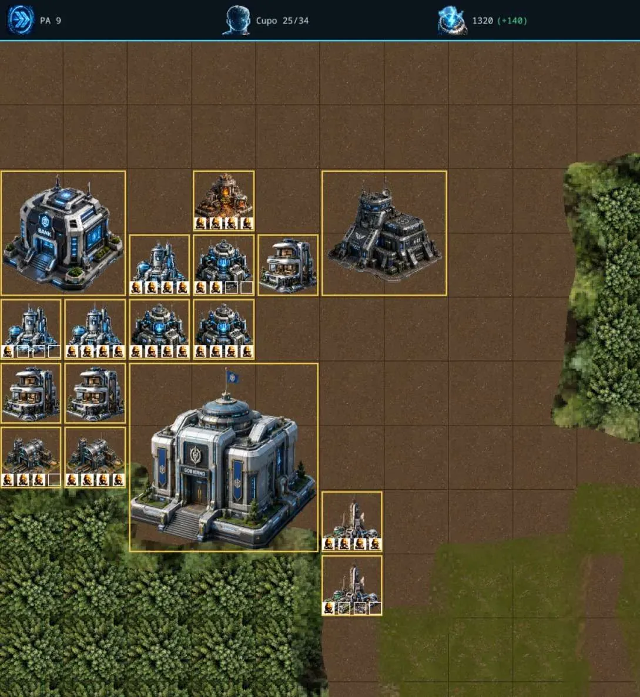</a> | **Trabajadores a la vista.** Cada extractor muestra bajo él cuántos de sus cuatro puestos están ocupados. |
| **6** | <a href="assets/img/museo/06.webp">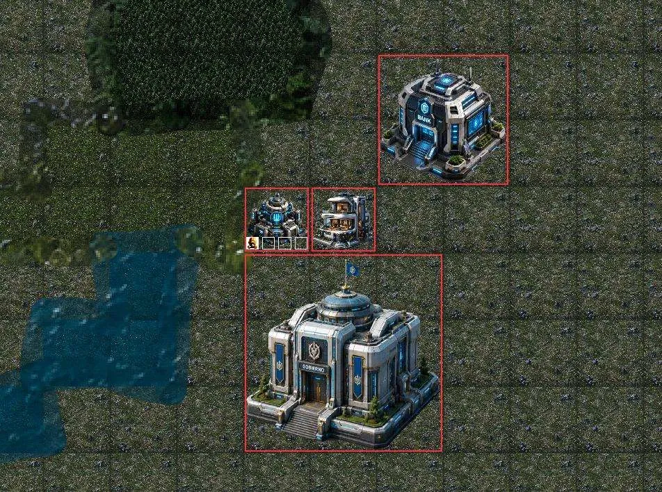</a> | **Terreno nuevo.** Hierba, lagos y bosques rediseñados, con los edificios marcados en el color del jugador. |
| **7** | <a href="assets/img/museo/07.webp">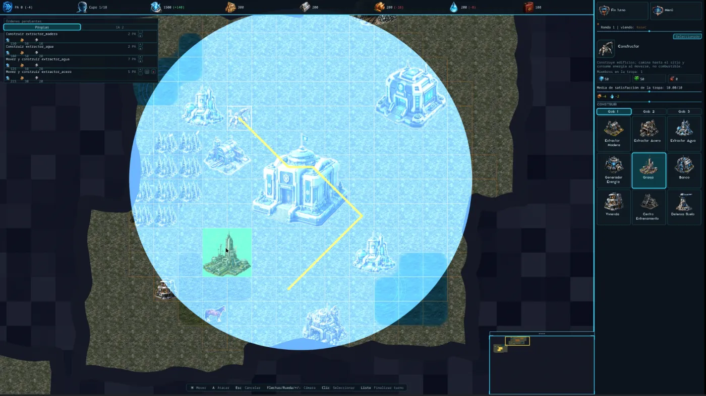</a> | **Rondas simultáneas.** Cola de órdenes, panel lateral de construcción y el área de energía al colocar un edificio. |
| **8** | <a href="assets/img/museo/08.webp">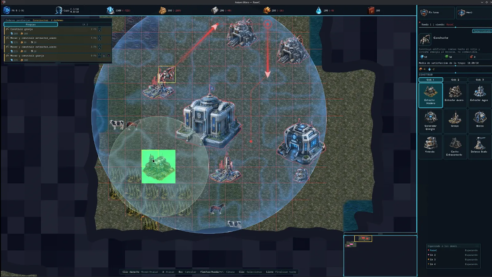</a> | **Planificación sobre el mapa.** El Constructor encadena órdenes de mover y construir, las flechas marcan su ruta y la cuadrícula muestra el área de energía del Gobierno. |

## Unidades de la Facción Terránea

Nueve unidades, de la mina al cielo. Cada ficha detalla producción, mantenimiento, defensa, movimiento y lo que desbloquea cada nivel de Gobierno.

| | Unidad | Clase | Vida | Escudo | Visión |
|---|---|---|---:|---:|---:|
| 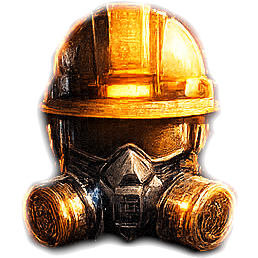 | [Trabajador](docs/unidades/trabajador.md) | Civil, en su edificio | 50 | — | — |
| 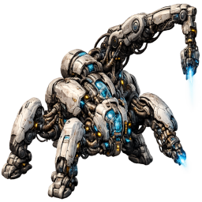 | [Constructor](docs/unidades/constructor.md) | Ligera · civil | 50 | 50 | 4 |
| 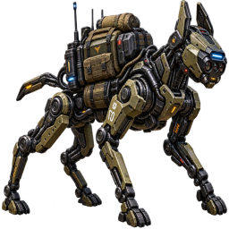 | [Explorador](docs/unidades/explorador.md) | Ligera · cuerpo a cuerpo | 60 | 30 | 10 |
| 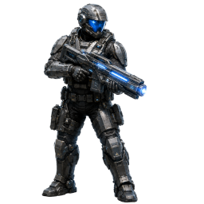 | [Militar](docs/unidades/militar.md) | Ligera · a distancia | 50 | 30 | 7 |
|  | [Científico](docs/unidades/cientifico.md) | Ligera · apoyo | 40 | 40 | 5 |
| 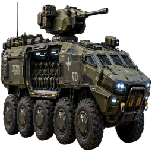 | [Transporte APC](docs/unidades/transporte_apc.md) | Media · transporte | 150 | 100 | 6 |
| 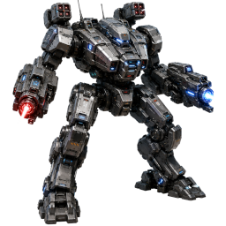 | [Meca](docs/unidades/meca.md) | Pesada · área | 250 | 150 | 6 |
| 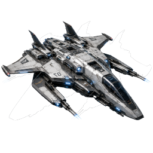 | [Raptor](docs/unidades/raptor.md) | Media · aérea | 180 | 120 | 9 |
|  | [Droide](docs/unidades/droide.md) | Ligera · aérea | 60 | 120 | 8 |

Índice con el papel de cada unidad: [docs/unidades](docs/unidades/README.md) · Las nueve fichas para imprimir: [Fichas-Terranea.pdf](docs/unidades/Fichas-Terranea.pdf)

## Balanceo

El informe de balanceo de la Facción Terránea (propuesta v12) analiza las nueve fichas a la vez y propone los números de todas las armas y habilidades. Su idea central: cada blindaje tiene armas que le hacen daño completo y armas que apenas le hacen nada, de modo que la unidad correcta contra su objetivo sea 2–3 veces más eficiente por PA que la incorrecta.

Incluye la matriz de daño arma contra unidad, la economía de PA, energía y compras, alcance y visión, comprobaciones de combate, vida de los edificios y un repaso unidad por unidad.

- **Leerlo en el navegador:** [cesar-rgon.github.io/axiom-wars/docs/balanceo/](https://cesar-rgon.github.io/axiom-wars/docs/balanceo/)
- **PDF:** [Balanceo-Terraneo-v12.pdf](docs/balanceo/Balanceo-Terraneo-v12.pdf)

## Descargar y jugar

| Sistema | Descarga |
|---|---|
| Windows 64 bits | [AxiomWars-Windows-x64.zip](https://github.com/cesar-rgon/axiom-wars/releases/latest/download/AxiomWars-Windows-x64.zip) |
| Linux x86-64 | [AxiomWars-Linux-x64.zip](https://github.com/cesar-rgon/axiom-wars/releases/latest/download/AxiomWars-Linux-x64.zip) |
| macOS (Apple Silicon) | Próximamente |

1. Descomprime el zip y abre **AxiomWars.exe** (Windows) o **AxiomWars** (Linux) dentro de la carpeta `AxiomWars`. Deja la carpeta `assets` a su lado.
2. En el campo **Host (IP o DNS:puerto)** escribe la dirección del servidor.
3. La IP del Host se publica en el [canal de Discord](https://discord.gg/3rsTp3DdGh).

## Créditos

<table>
  <tr>
    <td align="center" width="25%" valign="top">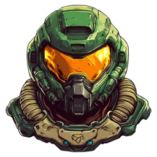<br><sub>Creador y analista</sub><br><b>RaseC</b></td>
    <td align="center" width="25%" valign="top"><br><sub>Programador</sub><br><b>Claude AI</b></td>
    <td align="center" width="25%" valign="top"><picture><source media="(prefers-color-scheme: dark)" srcset="assets/img/credits/chatgpt-pad.svg"></picture><br><sub>Diseñador</sub><br><b>ChatGPT</b></td>
    <td align="center" width="25%" valign="top"><picture><source media="(prefers-color-scheme: dark)" srcset="assets/img/credits/suno-pad.svg"></picture><br><sub>Compositor</sub><br><b>Suno AI</b></td>
  </tr>
</table>

**Analistas colaboradores:** Kiwi · Gameover · Nightlane · Calheb · Miky · Fr4nk50

## Sobre este repositorio

Este repositorio aloja la web del juego (GitHub Pages) y las descargas del cliente (Releases). El código del juego se desarrolla aparte.

```
index.html          web publicada en https://cesar-rgon.github.io/axiom-wars/
assets/img/         logo, unidades, galería, museo y créditos
assets/js/i18n.js   traducción al español de la web (por defecto, inglés)
docs/unidades/      fichas de las unidades Terráneas (Markdown y PDF)
docs/balanceo/      informe de balanceo (HTML y PDF)
docs/units/         las mismas fichas en inglés
docs/balance/       el mismo informe en inglés
tools/make_logo.py  recorta el logo original a PNG transparente
```

Cada release contiene sólo los binarios del cliente para Windows y Linux; el servidor no se distribuye.
